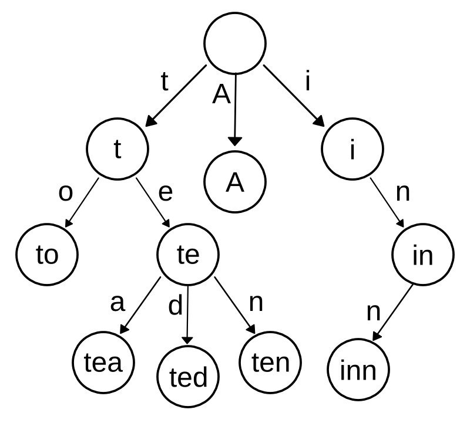

# Word-Counter #

This small project was inspired by a programming assignment on course I was demonstrating/marking on. The students had to create a program to count the frequency with which each unique word occurs in a file. They were to use a couple of data structures to store the words and associated counts, including IIRC linked lists, arrays and trees. "Trees" here was meant to mean "binary search trees", however as I was currently working with [octrees](https://en.wikipedia.org/wiki/Octree) (think a quadtree but in three dimensions, or a binary tree but with eight children per node vs two), a different interpretation came to mind.

This project is licenced under the terms of the MIT licence.

## A 27-ary Tree ##

This solution is built around a 27-ary tree, one child node for each letter of the alphabet, plus one for the apostrophe. This concept, it turns out, is known as a [Trie](https://en.wikipedia.org/wiki/Trie).



_Adapted from public domain work found on Wikipedia._

## How it works ##

Being a tree, there exists exactly one path from the root to every other node. The sequence of nodes in this path represents a word and the frequency (number of occurrences) of the word can be stored at the node where it terminates. So to add a word to the tree, we follow the path determined by the letters and increment a counter at the node where the path terminates. To retrieve all the counts (e.g. when we pretty-print them at the end of our counting) we do a depth-first traversal of our tree, and when we hit a node with a non-zero counter, we print it and the associated count (which involves a little back tracking in my implementation).

## Usage ##

### Building  and running ##

I've only tested with GCC 4.8 using `-std=c99` (as per the Makefile) on Linux.
`cd build && make`
`./wordcounts <textfile>`

### Example output ##

```
./wordcounts Makefile 
                      all | 1
                        c | 10
                       cc | 5
                   cflags | 5
                    clean | 2
                      dir | 7
                        f | 2
                     flag | 2
                      gcc | 1
                     main | 6
                        o | 21
                 pedantic | 1
                       rm | 2
                      src | 8
                      std | 3
                   target | 3
                     text | 8
                     trie | 7
                veryclean | 1
                     wall | 1
                   werror | 1
                   wextra | 1
               wordcounts | 3
```

## Performance ##

### Time Complexity ###

Let's take a high level look at what the program does:
```
read in the file
preprocessing on each letter:
  replace non word characters (apart from apostrophes) with null characters.
  convert upper case characters to lower case.
for each word:
  for each letter in the word:
    traverse to the child node representing that letter
  after the last letter, increment the counter
search each node in the tree for non-zero count:
  if count > 0:
    print word, count
```

The overall time complexity is _O(n)_ where n is the number of characters in the input. The preprocessing rules operate on each character - clearly _O(n)_. Emplacement of words in the tree is also linear time - word length determines the length of the path taken to where the count is recorded, and this happens _m_ times, where _m_ is the number of words. If _μ_ is the average length of a word in the input, then _μm_ is bounded by _n_ (we can't have more words than letters), therefore we do _<= n_ steps of tree traversal in this stage. In the depth-first-search stage, we visit each node in the tree. There are at most _n_ nodes in the tree since we can create at most one for each character, so we do at most n steps - again _O(n)_.

Although the maximum length of a word is bounded by _n_. [Long words](https://en.wikipedia.org/wiki/Longest_word_in_English) will have an impact on the practical run time (more calls to `malloc` as we expand the tree), but has no bearing on the theoretical run time.

### Practical Performance ###

Testing on the [works of Shakespeare](https://ocw.mit.edu/ans7870/6/6.006/s08/lecturenotes/files/t8.shakespeare.txt) (5.4MB, 901325 words, 26159 unique words). Execution time on Linux on my wimpy old laptop is ~0.26s (with output piped to `/dev/null` since writing the ~26k lines to the terminal slows it down significantly to ~1.9s). For some comparison, counting just the number of words (not unique) with `wc -w` took ~0.21s (again piped to `/dev/null` for fairness).

### Time complexity of Some Other Data Structures ###

#### Linked Lists ####

If we adhere to the requirement of storing the words alphabetically, linked lists don't perform very well. Each word stored is O(n) since we need to traverse through the list in order to find the right place to put the word (or increment the counter on an existing one). We do this at most _ceil(n/2)_ times (in the pathological case of all single letter words). The worst case time complexity is therefore _O(n<sup>2</sup>)_.

#### Array ####

Like the linked list approach, we must scan through the entries to emplace the words. Search and emplacement (including moving subsequent elements along is _O(n)_ and the possible reallocation and copying of the whole array would be _O(n)_, but should amortized to constant time if the growth of the array is exponential. These happen at most _m_ times each, so again the complexity is _O(n<sup>2</sup>)_.

#### Binary Search Tree ####

If we wish to sort the words as we record them then in the case of an alphabetised input, the BST is equivalent to a singly linked list, as it is a tree with height _<= m_ (the upper bound of which scales linearly with n), with only right children and no sibling nodes. In the average case, the tree hight is _log m_, giving us time complexity of _O(n log n)_.
